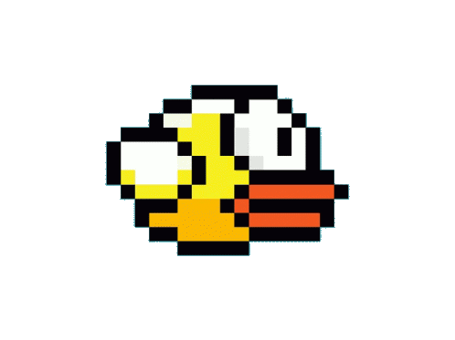

# Flappy Bird 

This project is a recreation of the popular game Flappy Bird, created for CSCI 318. It includes implementations of NFA, DFA, and PDA.

## Live Demo

You can play the game [here](https://flappy-bird-irt4.onrender.com/) (hosted with Render.com)

## Technologies Used
- Hosting Services
    - Cockroachlabs (CockroachDB)
    - Render.com
- Languages
    - JavaScript (Node.js and Client-Side)
    - HTML/CSS
    - SQL

## SQL Queries

Our project connects to CoachroachLab's SQL Server and sends queries to sync with the public leaderboard. 

SQL Queries Used
- INSERT INTO flappy_scores (NAME, SCORE) VALUES ('myName', 999);
- SELECT * FROM flappy_scores;
- DELETE FROM flappy_scores where name='name';